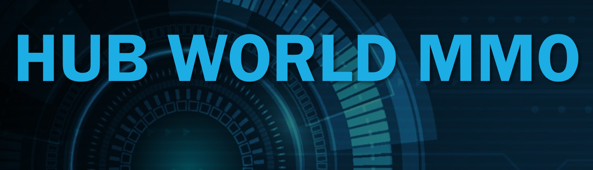

 
    
    <h4>
        <a href="http://www.sabredartstudios.com/">By SabreDartStudios</a>
    </h4>

    
    
    
    
    

---

## What is Hub World MMO?

<iframe width="100%" height="410" src="https://www.youtube.com/embed/tW-dclaNAmA" title="Hub World MMO - Introduction" frameborder="0" allow="accelerometer; autoplay; clipboard-write; encrypted-media; gyroscope; picture-in-picture" allowfullscreen></iframe>

## Setup Instructions

1. Install OWS 2 by following the [Setup Instructions](https://www.openworldserver.com/getting-started/) up to the point of getting your API key.  Once you have your API key, you can continue with setting up the Hub World MMO example project.
2. Fork the Hub World MMO project to your own GitHub.  This is a VERY important step if you intend to make modifications.
3. Once you have your own fork of the Hub World MMO project on your GitHub, then you can open Visual Studio 2022 and Clone it.
4. After it downloads all of the files, open Config/DefaultGame.ini and put your API key in the OWSAPICustomerKey and save the file.
5. Open OWSInstanceLauncher/appsettings.json and put your API key in OWSAPIKey.  You also need to set PathToDedicatedServer to point to your Unreal Engine 5 editor and set PathToUProject to point to the OWSHubWorldMMO.uproject file.
6. Open SQL Server Management Studio and connect to the OpenWorldServer database using the instructions from the OWS 2 setup.  Open SQL/Initialize.sql.  Add your API key to the top line of the SQL script, then run it.
7. Download the [Project Content Zip File](https://drive.google.com/file/d/1e8n-M7r4F5LXAxxAo6EJmjzemUxOsFye/view?usp=sharing) (5.8 GB) and copy the files into your Content folder.
8. Right click on the OWSHubWorldMMO.uproject file and click on "Generate project files..."
9. Open the OWS 2 project in Visual Studio 2022 and press docker-compose.  Give it a minute or two to fully start up.  You must repeat this step whenever you want to develop with the Hub World MMO project.  "docker-compose" MUST stay running in Visual Studio 2022 the entire time.
10. Open OWSHubWorldMMO.sln in a second copy of Visual Studio 2022 and press the green play button.

## Setup Instructions Video

<iframe width="100%" height="410" src="https://www.youtube.com/embed/21q3IvkFLnw" title="Hub World MMO - How to Install" frameborder="0" allow="accelerometer; autoplay; clipboard-write; encrypted-media; gyroscope; picture-in-picture" allowfullscreen></iframe>
